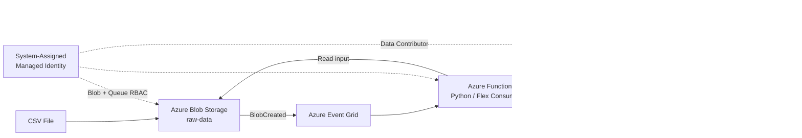

# Architecture

```mermaid
flowchart LR
    A[CSV File] --> B[Azure Blob Storage<br/>raw-data]

    B -->|BlobCreated| C[Azure Event Grid]

    C --> D[Azure Function<br/>Python / Flex Consumption]

    D -->|Read input| B
    D --> E[Validate & Process CSV]

    E -->|Valid data| F[Azure Cosmos DB<br/>pipeline-db / results]
    E -->|Invalid data| G[Failed Invocation]

    D --> H[Application Insights]
    H --> I[Log Analytics]

    J[System-Assigned<br/>Managed Identity] -.-> D
    J -.->|Blob + Queue RBAC| B
    J -.->|Data Contributor| F
```